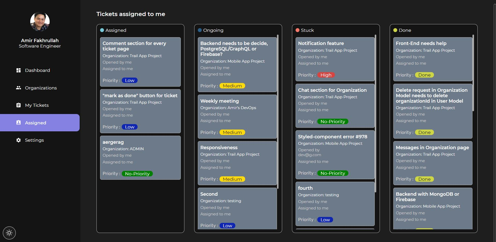
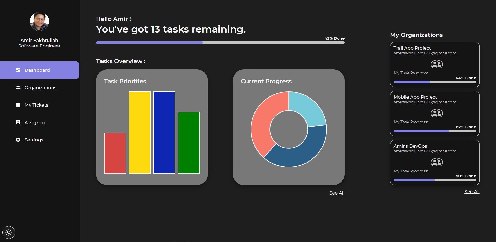
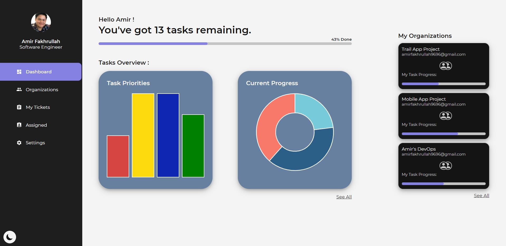
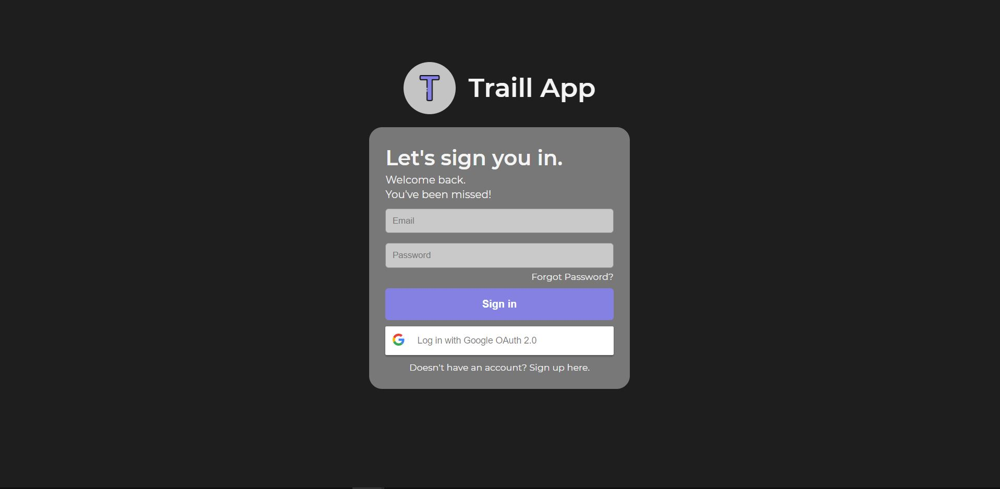

# Traill App

## Description

Kanban Bug Tracking System - track the bugs and also the development of software/apps. (The code provided here is only the front-end code).

## Features

* Team/Organization friendly app - All bug issues (tickets) are grouped in organization id. A team member can assign a bug issue to other team members.
* Progress tracker - tracks the progress based on priority and status in dashboard page.
* Privacy protection - all teams/organizations created in the app are private. To join the team, the admin of the team has to invite the user and the user will receive an invitation link in their email ( which expires in 1 hour).
* Light/Dark Mode
* Basic features - login, signup, reset password, CRUD request for users, organizations and tickets, Google Auth 2.0.

## Technologies

### Front-End

* React
* React Hooks
* Redux
* Styled-Components
* React-beautiful-dnd
* Material UI
* Formik
* React-Bootstrap
* JavaScript
* JSX
* CSS
* HTML

### Back-End

* Google Auth2.0
* REST APIs
* Express
* Node
* GridFS
* Nodemailer
* Google-auth-library
* JWT
* MongoDB

### Deployment

* Back-End - Heroku
* Front-End - Vercel

## Ongoing / Future Works

* Testing
